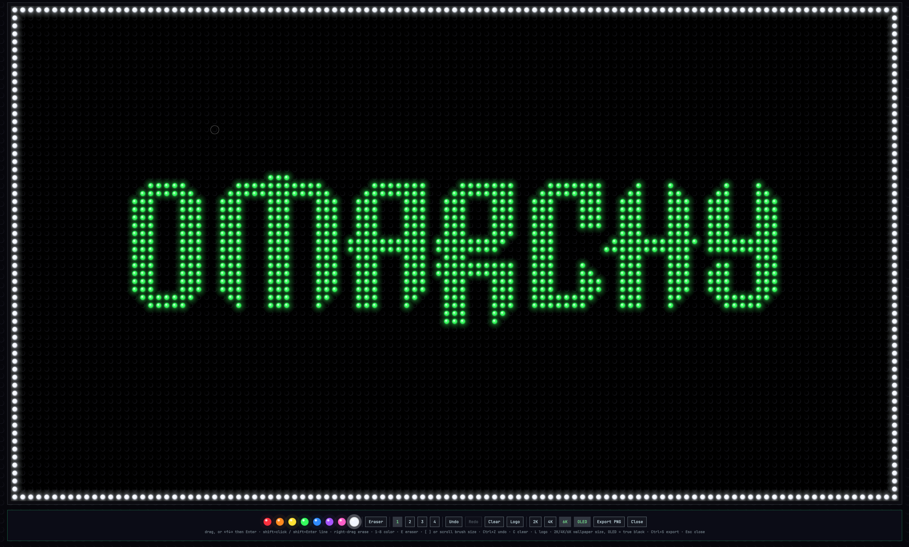

# Glow Studio

A glowing peg board for [Omarchy](https://omarchy.org), in the spirit of the
1967 toy: a black perforated sheet, eight translucent peg colors, and a light
behind it. It opens pre-lit with the OMARCHY wordmark in green and you draw
over it, or clear it and start from nothing.



## Install

```bash
omarchy plugin add https://github.com/perfektnacht/glow-studio.git
omarchy plugin enable perfektnacht.glow-studio right
omarchy restart shell
```

`bin/omarchy-glow-studio` wraps the same call if you'd rather have a command
(`toggle`, `show`, `hide`) on your `PATH`.

## Requirements

Omarchy 4 or newer, which provides `omarchy-shell` and the Quickshell runtime
this is written against. Nothing is bundled, vendored, or installed on your
behalf.

Two system commands are used, both already present on an Omarchy install:

| Command | Used for | Without it |
|---------|----------|------------|
| `notify-send` | Saying where an export landed | Exports still work, just silently |
| `mkdir` | Creating `~/Pictures` before the first export | The export fails rather than guessing another directory |

Nothing else is read or written, and the plugin makes no network connections
of any kind. Two paths belong to it:

- `~/.local/state/omarchy/glow-studio.json` — your board as you draw it, plus
  the export size and OLED choice
- `~/Pictures/glow-studio-<size>-<timestamp>.png` — exports, only when you ask

If you ran this plugin under its previous name, the board saved back then is
read once and carried over the first time you open Glow Studio. The old file is
left on disk rather than deleted, so nothing is lost either way.

## Removal

```bash
omarchy plugin remove perfektnacht.glow-studio
```

That disables it and deletes the plugin directory. Your board is deliberately
kept: it lives outside the checkout, so removing and reinstalling brings the
drawing back exactly as you left it. To clear that too:

```bash
rm ~/.local/state/omarchy/glow-studio.json
```

Exports in `~/Pictures` are yours and are never touched by removal.

## Drawing

Mouse and keyboard steer the same cursor — the ring on the board is always
where the brush will land, whichever one you last touched.

| Input | Does |
|---|---|
| left drag | place pegs |
| right drag | erase, without switching tools |
| `←` `↑` `↓` `→` | move the cursor one peg |
| `Enter` | place pegs at the cursor — the same as a left click |
| shift + click, shift + `Enter` | straight line from the end of the last stroke |
| scroll | brush size |
| `1`–`8` | pick a peg color |
| `E` | eraser |
| `[` `]` | brush size |
| `Ctrl+Z` / `Ctrl+Shift+Z` | undo / redo (60 strokes deep) |
| `C` | clear the board |
| `L` | put the OMARCHY logo back |
| `Ctrl+S` | export a PNG to `~/Pictures` |
| `Esc` | close |

The board autosaves to `~/.local/state/omarchy/glow-studio.json` a moment after
every stroke, so it comes back exactly as you left it. Delete that file to
start over from the logo.

## Wallpapers

`Export PNG` (or `Ctrl+S`) writes to `~/Pictures/glow-studio-<size>-<stamp>.png`
at whichever size is selected in the toolbar. Your choice is remembered.

| | |
|---|---|
| **2K** | 2560 × 1440 |
| **4K** | 3840 × 2160 (default) |
| **6K** | 5760 × 3240 |
| **OLED** | board goes true `#000000` instead of near-black `#08080b`, so an OLED panel actually switches those pixels off — most of the board is unlit, so it's most of the image |

Exports are **re-rendered** at the target size, not scaled up from the screen.
The board is discs on a grid, so painting it again at a bigger peg pitch costs
one repaint and gives clean edges; upscaling the ~2200px on-screen canvas to 6K
would just be a blurry 2200px canvas.

The board is 111:62 and the presets are 16:9, so they don't divide evenly. The
leftover margin gets filled with **more peg board** rather than a bare border —
the painter draws holes for every grid position the canvas covers, including
the ones past the edge of the board, and centers your drawing in it. OLED mode
applies to the screen too, so the preview is what you get.

## How it works

The grid is a fixed **111 × 62** regardless of monitor — a saved board reopens
identically on a different display, and the wordmark is guaranteed to fit. Cell
size is whatever makes that grid fill the screen.

All 6,882 holes are painted into a single `Canvas`. Thousands of QML
`Rectangle`s would be hopeless, and the board is static between edits, so the
canvas repaints only the rectangle a stroke touched (plus a margin for the
glow that bleeds out of it). Measured on this machine: a full repaint is
**~7ms**, a stroke's incremental repaint is **~1ms**, and an untouched board
paints **zero** frames — no idle GPU cost while it sits open.

The glow is stacked translucent discs rather than a per-peg radial gradient,
which lets every peg of a given color batch into one fill. Overlapping halos
accumulate, so dense areas of a drawing bloom the way the real toy does.

One painter serves both the screen and every export size — it takes a peg pitch
and a grid origin, so an export is the same code at a bigger pitch. The export
canvas uses `Canvas.Threaded`, which matters a lot: rasterizing 18.7 megapixels
on the scene-graph thread froze the whole shell for **~3.7s** at 6K, and moving
it to its own thread cuts that to **~600ms** for byte-identical output. Because
that thread can't safely read QML properties, everything the painter needs is
snapshotted into plain JS before the paint starts — which also means an export
captures the board as it was when you pressed the button.

What's left is the grab readback and the PNG encode, both unavoidably
synchronous on the GUI thread: roughly **150ms at 2K, 290ms at 4K, 600ms at
6K**. The export canvas is only mounted while an export is running — at 6K its
image buffer alone is ~75MB.

### The wordmark

`Board.js` carries the Omarchy screensaver's ASCII art verbatim and expands it
at load time. Each source character is one peg column and *two* peg rows: the
half-block characters (`▀`, `▄`) carry vertical sub-cell detail, so expanding
`▀` to (on, off) and `▄` to (off, on) recovers the letterforms at their true
2:1 aspect instead of squashing them onto the terminal's cell grid. The result
is 81 × 19 pegs, centered on the board.

## Security

Reviewed against the [Omarchy Plugin Marketplace][mp]'s pre-submission security
scan on 19 August 2026, at commit `d55e9dc`, and re-checked after the rename to
Glow Studio, which moved names and paths without changing what the plugin does.

**This is a self-review, not a marketplace audit.** Nobody from the marketplace
has reviewed this repository. Omarchy plugins run unsandboxed as upstream code,
so no scan — this one included — makes a plugin safe. It is published so you can
check the claims rather than take them.

**No code changes were needed.** What the scan confirmed:

- No network access of any kind — no URLs, no remote images, no downloads.
- No shell strings. The two external commands it runs, `notify-send` and
  `mkdir`, are passed as argument arrays with fixed arguments.
- Two paths are written, both listed under [Requirements](#requirements), and
  nothing outside them.
- No credentials, no privileged commands, no bundled binaries, no dependencies
  beyond what Omarchy already ships.

Found something this missed? Report it privately through the marketplace's
[security policy][sec], or open an issue here.

[mp]: https://github.com/omacom/omarchy-plugin-marketplace
[sec]: https://github.com/omacom/omarchy-plugin-marketplace/blob/main/SECURITY.md

## License

MIT
